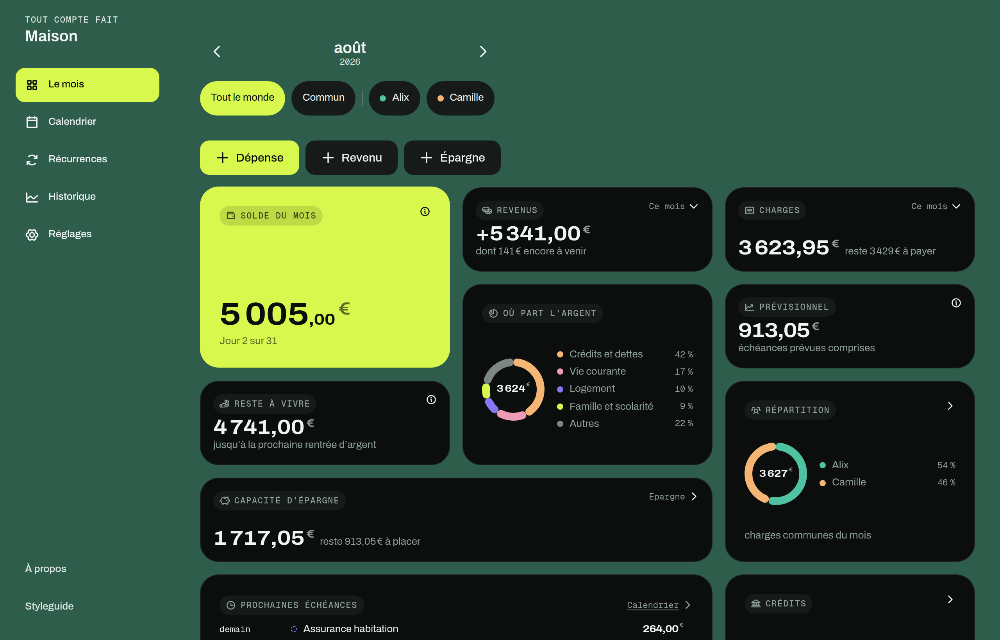
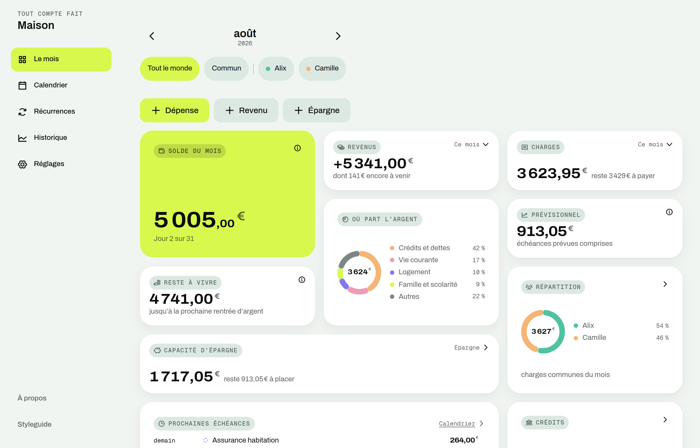
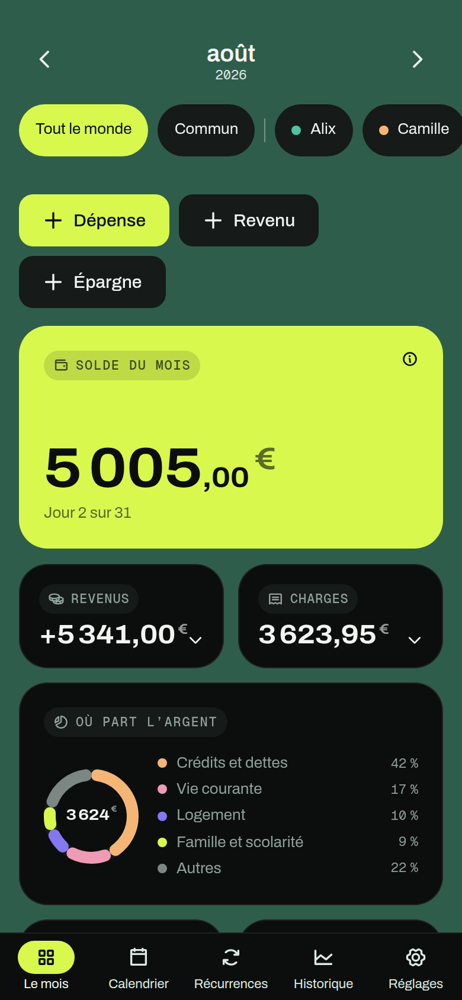

<div align="center">

# Tout compte fait

**Le suivi des finances du foyer, sans compte et sans serveur.**
Les données vivent dans le navigateur. Rien ne sort de l'appareil.

[](https://github.com/alarboulletmarin/tout-compte-fait/actions/workflows/ci.yml)
[](LICENSE)
[](#installation-sur-le-t%C3%A9l%C3%A9phone)

[**Ouvrir l'app**](https://toutcomptefait.xyz) · [Documentation](docs/) · [Contribuer](CONTRIBUTING.md)



</div>

---

## Ce que c'est

Une app de budget familial qui tient dans un onglet. On y déclare ses
récurrences — salaires, loyer, abonnements, mensualités de crédit — et chaque
mois s'ouvre tout seul en prévision, qu'on confirme au fil de l'eau. Le reste
suit : capacité d'épargne, capital restant dû, répartition des charges communes
au prorata des revenus.

- **Récurrences** à montant fixe ou variable, dépenses et recettes ponctuelles.
- **Prévu puis confirmé** — le mois est une prévision qu'on valide, pas un
  formulaire à remplir.
- **Répartition au prorata des revenus**, avec régularisation du mois suivant
  quand une charge commune a été avancée par une seule personne.
- **Crédits** avec capital restant dû calculé, jamais stocké.
- **Épargne** : capacité, ventilation par support, reste à placer.
- **Historique** et comparatifs mois/mois et année/année.
- **Export / import** du fichier de données, thème clair et sombre, hors ligne.

<table>
<tr>
<td width="62%"></td>
<td width="38%"></td>
</tr>
<tr>
<td align="center"><em>Le même écran en thème clair</em></td>
<td align="center"><em>Sur téléphone</em></td>
</tr>
</table>

## Où vont les données

Nulle part. Il n'y a ni compte, ni serveur, ni analytics, ni cookie tiers : le
document vit en IndexedDB dans le navigateur, et l'app fonctionne en mode avion.
Personne — auteur compris — ne peut lire un foyer.

La contrepartie est réelle et il faut la connaître : **vider les données du
navigateur efface le foyer**, et rien ne se synchronise entre deux appareils.
D'où l'export, un fichier JSON qu'on range où l'on veut, et le rappel qui le
propose tous les trente jours.

## Démarrer

Node 22.12 ou plus récent.

```sh
git clone https://github.com/alarboulletmarin/tout-compte-fait.git
cd tout-compte-fait
npm install
npm run dev
```

| Commande | Effet |
|---|---|
| `npm run dev` | serveur de développement |
| `npm run build` | build de production |
| `npm run preview` | sert le build |
| `npm run typecheck` | `tsc --noEmit` |
| `npm run lint` | ESLint |
| `npm test` | Vitest |
| `npm run verify` | les quatre d'un coup — c'est la porte de sortie |

Rien à configurer : aucune variable d'environnement, aucune clé d'API. Pour voir
l'app pleine plutôt que vide, **Réglages → Jeu d'exemple → Charger l'exemple**
monte quinze mois de données à partir d'aujourd'hui — c'est ce qu'on voit sur
les captures ci-dessus.

### Installation sur le téléphone

C'est une PWA : ouvrir [toutcomptefait.xyz](https://toutcomptefait.xyz), puis
« Ajouter à l'écran d'accueil ». Elle s'ouvre ensuite en plein écran et
fonctionne hors ligne.

## Pile technique

React 19 · TypeScript · Vite · Tailwind CSS 4 · zustand · IndexedDB (`idb`) ·
Vitest · vite-plugin-pwa.

Aucune librairie de graphiques : l'anneau, les barres et les courbes sont des
composants SVG maison. Aucun backend, donc aucun coût de fonctionnement.

## Documentation

| Document | Répond à |
|---|---|
| [Cahier des charges](docs/CAHIER-DES-CHARGES.md) | Ce que l'app fait, et ce qu'elle ne fera pas |
| [Design system](docs/DESIGN-SYSTEM.md) | De quoi elle a l'air |
| [Architecture](docs/ARCHITECTURE.md) | Comment le code est rangé, et pourquoi |
| [Déploiement](docs/DEPLOIEMENT.md) | Comment la mettre en ligne |

Le cahier des charges et le design system sont la **source de vérité** : le code
leur obéit, et un écart est un bug. Les écarts assumés sont listés, mesurés et
justifiés dans [l'architecture](docs/ARCHITECTURE.md#écarts-au-design-system).

## Contribuer

C'est un projet personnel dont le code est ouvert : les rapports de bug sont
lus et bienvenus, les propositions de fonctionnalité passent par une issue avant
tout code. Tout est dit dans [CONTRIBUTING.md](CONTRIBUTING.md), et la marche à
suivre pour signaler une faille dans [SECURITY.md](SECURITY.md).

Le code, les commits, les issues et l'interface sont **en français**. C'est un
choix, pas un oubli.

## Licence

[MIT](LICENSE) — reprends, modifie, redistribue, y compris pour un usage
commercial. Garde simplement la mention de copyright.
